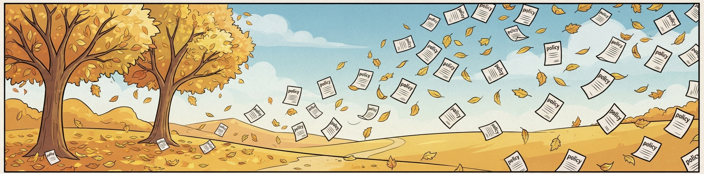
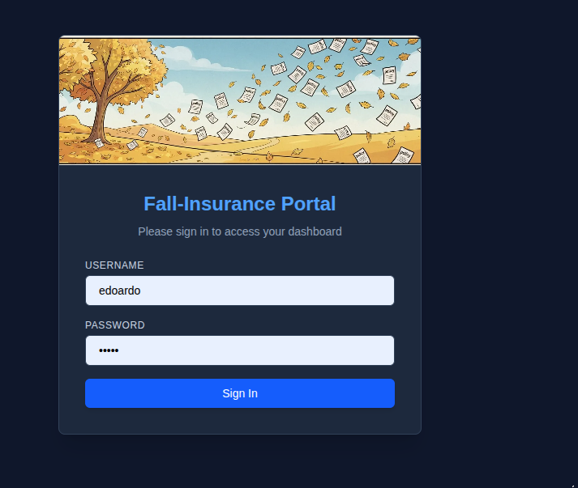
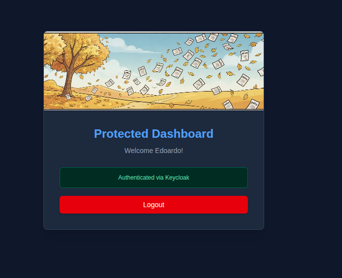

# 🍂 Fall-Insurance

Enterprise insurance back-office platform with AI-driven workflows and Scrum governance.

---

## 🚀 Overview
**Fall-Insurance** is a robust enterprise back-office solution designed for the insurance sector. It manages policy lifecycles, automates claim and document processing using integrated AI workflows, and ensures rigorous agile tracking through Scrum governance.

## 🔐 Authentication & Security Architecture
The platform implements a modern zero-trust security perimeter using **Keycloak** as the centralized OIDC provider integrated seamlessly with a **Spring Boot API Gateway** via OAuth2 Resource Server.

- **Identity Provider (Keycloak)**: 
  - Dedicated `fall-insurance` realm configuration.
  - Client ID setup, management of CORS policies, and secure session handling.
  - User profiling mapping, custom attributes, and administrative dashboard governance.
- **API Gateway & Spring Security**:
  - Secure routing and token validation (`Bearer` JWT verification via Keycloak Issuer URI).
  - Internal Docker bridge networking (`fall-insurance-net`) ensuring robust service-to-service communication.

| Login View | Protected Dashboard |
| :---: | :---: |
|  |  |

## 🛠️ Technology Stack
- **Core Backend**: Java, Spring Boot, Spring Security, Spring Cloud Gateway
- **Identity & Auth**: Keycloak (OIDC / OAuth2)
- **Database**: PostgreSQL
- **Architecture**: Microservices, Event-Driven, Docker Compose
- **Governance & Process**: Scrum-aligned enterprise workflows
