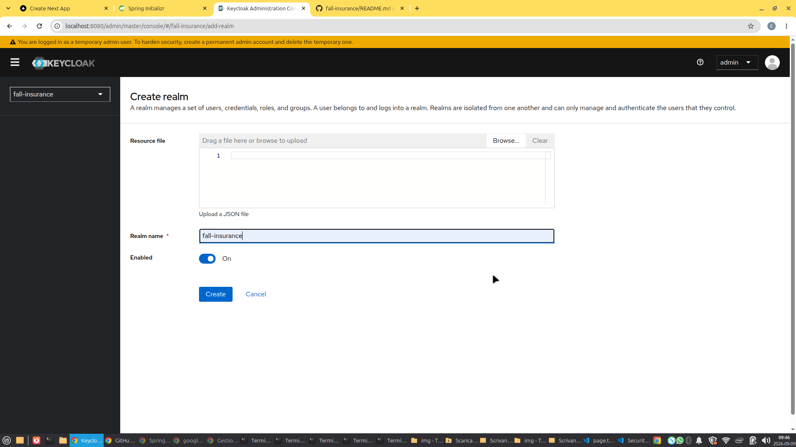
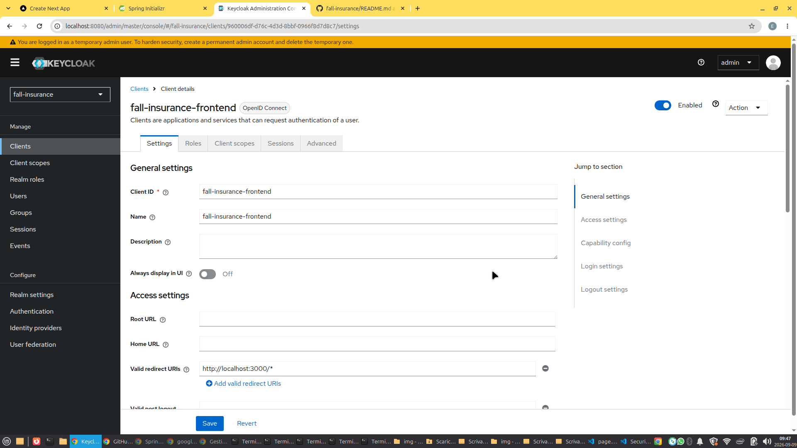
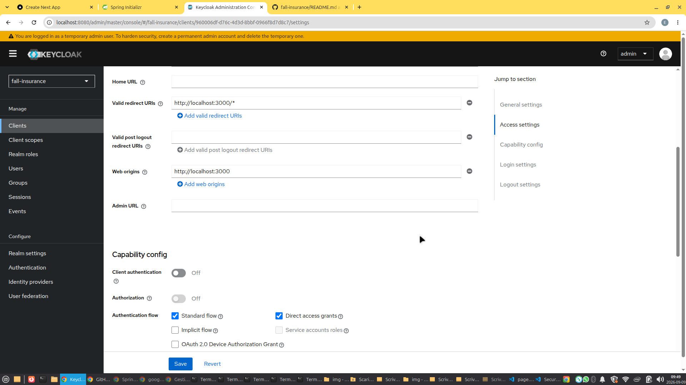
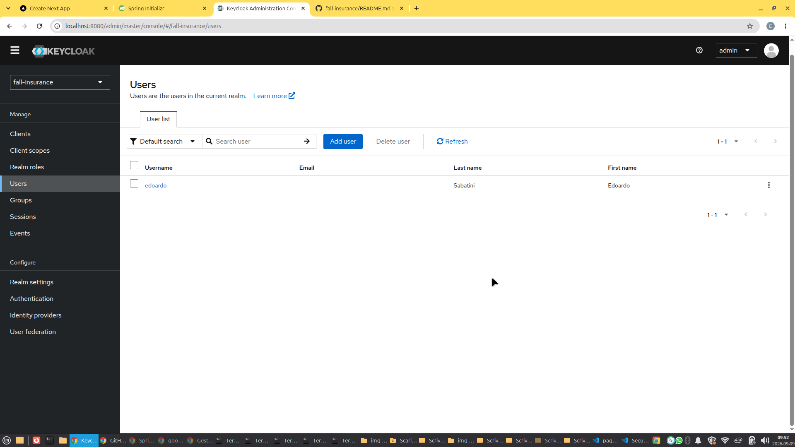

# Keycloak Getting Started Guide

* [← Back to Main Guide](../../../tree/main/docs/Getting_Started.md)

This technical guide covers the initial configuration steps for setting up Keycloak as the Identity Provider (IdP) for the enterprise platform, including realm initialization, client registration, and user provisioning.

---

## 1. Realm Creation
First of all, you need to create a dedicated security realm to isolate the application's authentication context. 

* Navigate to the Keycloak Administration Console and click on the realm dropdown menu in the top-left corner.
* Click **Create realm** and define the unique realm identifier.

---

## 2. Client Setup
Next, register the frontend or gateway client application to handle OIDC authentication flows. This process is divided into two main configuration screens.

* **Client Settings**: Configure the Client ID, enable authentication flow types, and set valid redirect URIs.
* **Credentials & Protocol Mappers**: Ensure standard compliance for token generation and secure service-to-service communication.

| Client Setup - Step 1 | Client Setup - Step 2 |
| :---: | :---: |
|  |  |

---

## 3. User Provisioning
Finally, provision test and administrative accounts within the newly created realm to test login workflows and RBAC permissions.

* Go to the **Users** section from the sidebar menu and click **Add user**.
* Fill in the mandatory identity details (Username, Email, First Name, Last Name) and set initial credentials under the **Credentials** tab.

